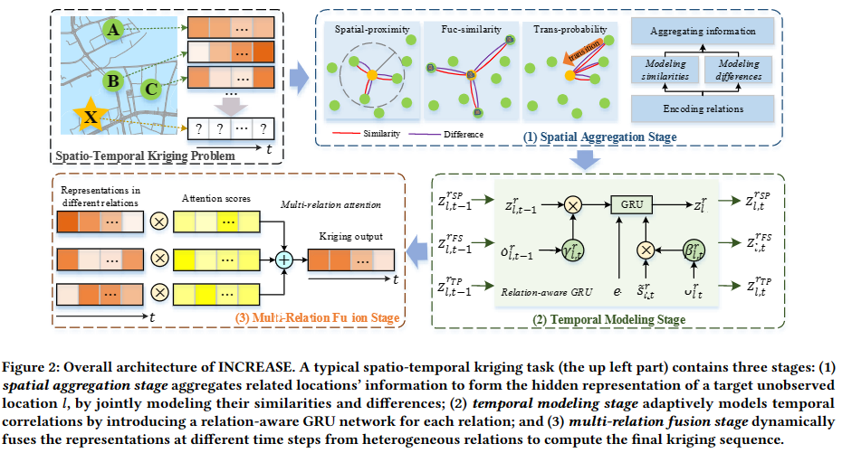
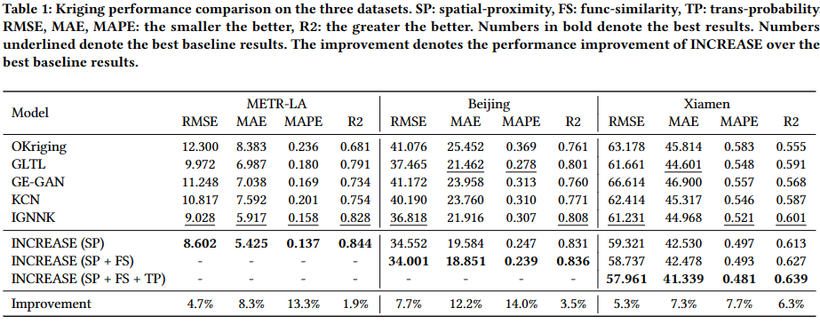

# INCREASE(WWW-23)

This repository is Tensorflow implementation for the WWW-23 paper [INCREASE: Inductive Graph Representation Learning for Spatio-Temporal Kriging](https://arxiv.org/abs/2302.02738).

The in-depth interpretation of this paper is [here](https://mp.weixin.qq.com/s/30xPLN2N9l_gw5l1OH6ADA) in Chinese.

## Data
* The METR-LA dataset is available at [Google Drive](https://drive.google.com/open?id=10FOTa6HXPqX8Pf5WRoRwcFnW9BrNZEIX) or [Baidu Yun](https://pan.baidu.com/s/14Yy9isAIZYdU__OYEQGa_g), provided by [DCRNN](https://github.com/liyaguang/DCRNN), and should be put into the corresponding `data/` folder.
* The Beijing dataset can be found in this repository under the [/Beijing/data/](Beijing/data) path
* The Xiamen dataset is still being compiled and will be coming soon

## Result

## Citation
